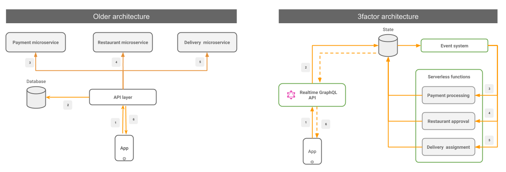

# 3factor app

3factor app is an architecture pattern for modern full-stack apps. Today, it is possible to build apps that have high feature velocity and scalability from the get go. [Jump](https://github.com/hasura/3factor-example) to reference implementation.

[We](https://hasura.io) propose an architecture pattern which is composed of 3 factors:

1. [Realtime GraphQL](realtime-graphql.md)
2. [Reliable eventing](reliable-eventing.md)
3. [Async serverless](async-serverless.md)

Consider a traditional food ordering application which moves to a 3factor architecture:

## Factor #1: Realtime GraphQL

Use GraphQL for a very simple and flexible frontend developer workflow. GraphQL is a crucial component for delivering high feature velocity. Your GraphQL layer should also support the following 2 properties:

- **Low-latency**: An end-user should see [instant
  feedback](https://stackoverflow.com/a/164290/3364697) of an action and not
  have to wait long on an API (<100ms ideal, upto 1 second at worst).
- **Support subscriptions**: Consume information "realtime" from the backend via GraphQL Subscriptions.
  Avoid the use of continuous polling (thereby reducing resource consumption).

[Read more...](realtime-graphql.md)

## Factor #2: Reliable eventing

Remove in-memory state manipulation in your backend APIs and persist them as atomic events instead.
Having an immutable event log helps in crash recovery, replayability and observability among others.
Your event system should have the following 2 properties:

- **Atomic**: Mutations to the application state should atomically create event(s).
- **Reliable**: Events once emitted should be delivered (to any consumer) atleast once.

[Read more...](reliable-eventing.md)

## Factor #3: Async serverless

Write business logic as event handlers. Deploy these event handlers on serverless compute.
Serverless minimizes backend ops and gives free scalability while being cost-efficient.
The serverless backends should follow few best-practices:

- **Idempotent**: The code should be prepared for atleast-once (for same event) delivery of events.
- **Out-of-order**: Events may not be guaranteed to be received in the order of creation. The code should not depend on any expected sequence of events.

[Read more...](async-serverless.md)

---------------------------------------------------------

In short, a 3factor app requires you to remove state from your code and put it in your
datastore and/or event queues as much as possible. Cloud vendors make it easy to scale and replicate
your datastore, event-queues and compute backend. Consuming asynchronous information and performing sync actions in the frontend
requires a high-performant realtime GraphQL API.

An interesting sidenote: A 3factor app's architecture is analogous to the [redux](https://redux.js.org/) dataflow
model on a react app, but applied to the fullstack.

### Comparison to 12factor.net
The 3factor name is inspired from 12factor.net. 12factor.net, created 7 years ago by the folks at Heroku, is a guide/best-practices for creating microservices based applications for modern cloud. Although the name is similar, 3factor.app is actually an application design pattern.

### Reference implementation
A complete step-by-step reference implementation for a 3factor app is available at: [github.com/hasura/3factor-example](https://github.com/hasura/3factor-example/)

<!---
3factor, 3-factor, 3factor app, 3-factor app, Three Factor app, Three-Factor app
-->
